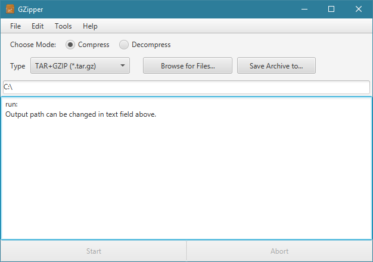
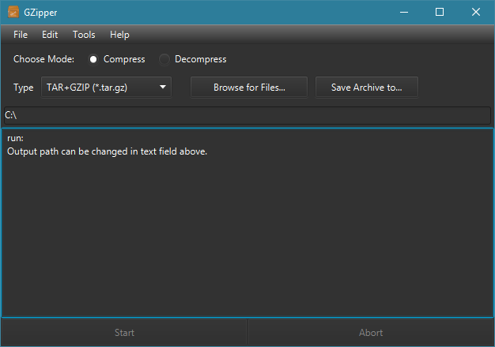
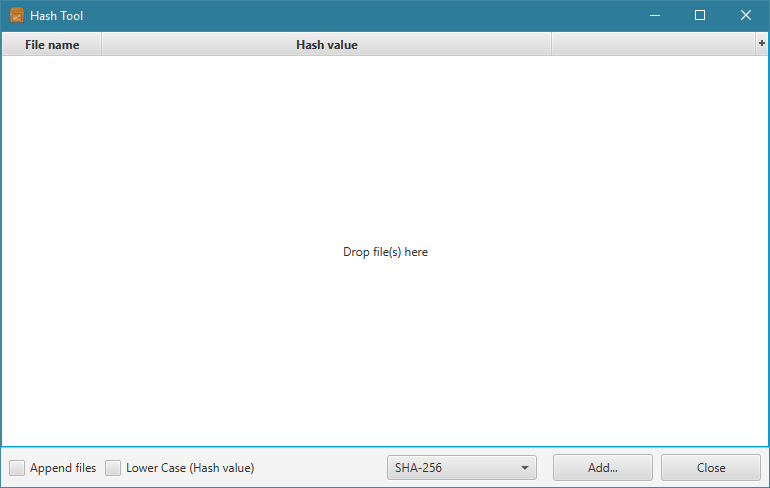
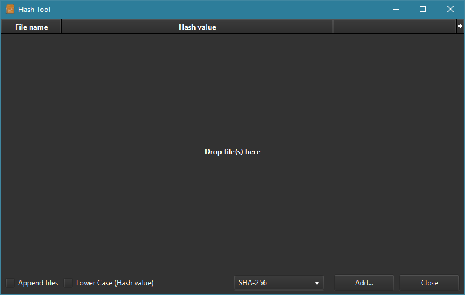

<p align="center">
  
  <h1 align="center">GZipper</h1>
</p>


## Features

* Create and extract the following archive types:
  - ZIP
  - JAR
  - Tarball (GZIP)
  - Tarball (BZIP2)
  - Tarball (LZMA)
  - Tarball (XZ)
* Compress and decompress GZIP
* Compression levels can be adjusted
  - if supported by compressor
* Support for regular expressions
  - allows filtering of files/entries
* Supports a dark theme (CSS style)
* Message Digest algorithms:
  - MD5
  - SHA-1
  - SHA-256
  - SHA-384
  - SHA-512
* Languages which are supported:
  - English
  - German

## Compatibility

<b>The application has been tested on these platforms:</b>
 * Windows 10
 * Ubuntu (20.04)

*Note, that it should work on newer versions of these operating systems as well if a compatible JRE is used, but it is not guaranteed. The same is true for different Linux distributions.*

## Quick Start

In order to quickly launch the application, run either of the following scripts:
* `run_gzipper.bat`
* `run_gzipper.sh`

On Linux-based systems, make sure that the script file is executable by running the following:

```shell
chmod +x run_gzipper.sh
```

You may want to alter the script to point to a different Java home directory.<br />
The scripts assume that a compatible Java version is available in `PATH`.<br />

If there is a `JAVA_HOME` environment variable set, then the script `run_gzipper.bat` may e.g. be altered to:

```bash
start /min PowerShell.exe -WindowStyle Hidden "& "$env:JAVA_HOME\bin\java" --module-path ..."
```

## Command line arguments

`--launch_mode`
- `application`
  - Default. Launches the entire application.
- `hashview`
  - Launches hash (message digest) view only.

## Attribution

For compression and decompression this application uses parts of the commons-compress library by Apache Foundation as well as 'XZ for Java' by Tukaani. Their source code and documentation can be found here: 
  - <a href>http://commons.apache.org/</a>
  - <a href>https://tukaani.org/</a>

## Remarks

This application is built for Java 11 and higher and supports Kotlin.<br />
Since version 2.0.0, the main (or master) branch targets Java 17.

# Screenshots

<b>Main view with enabled default theme:</b><br />


<br /><b>Main view with enabled dark theme:</b><br />


<br /><b>Hash view with enabled default theme:</b><br />


<br /><b>Hash view with enabled dark theme:</b><br />

